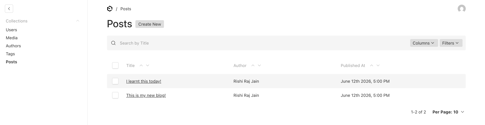
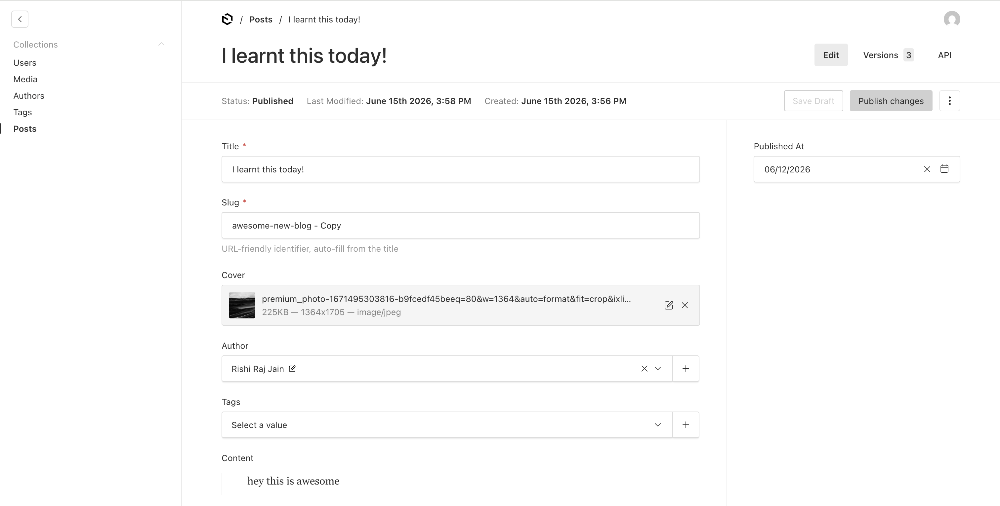
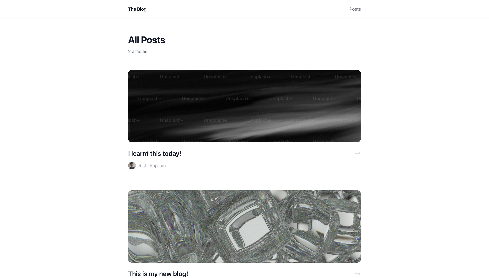
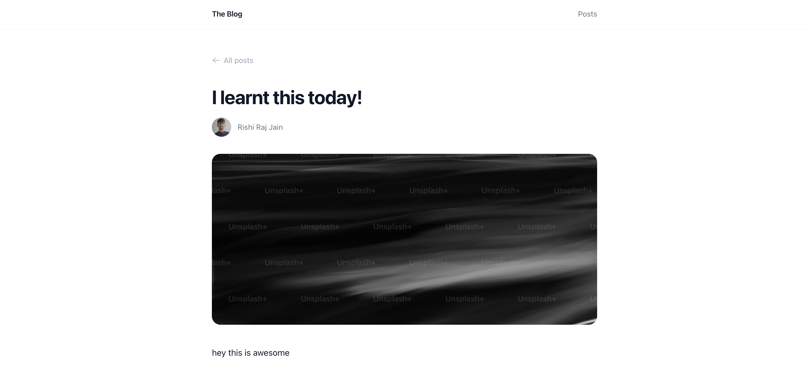
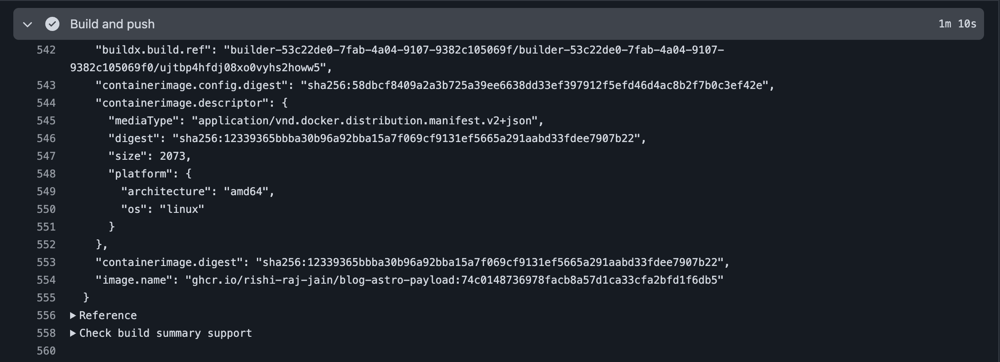
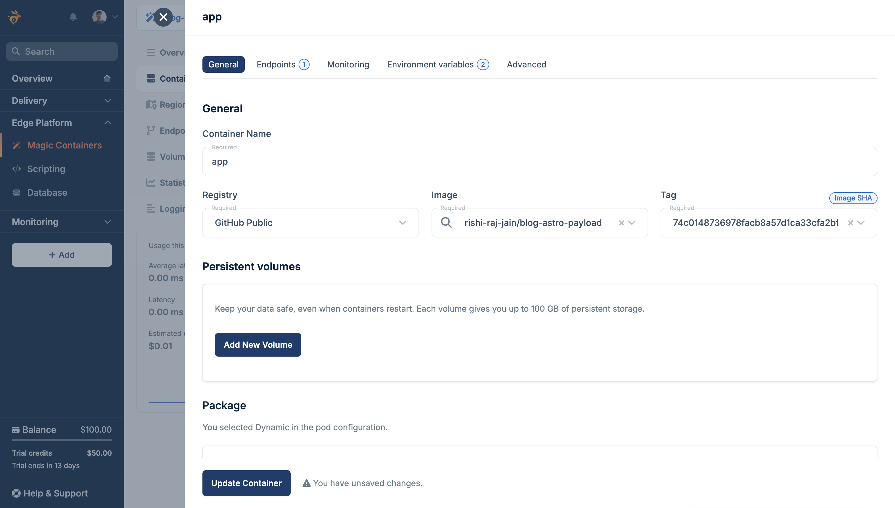
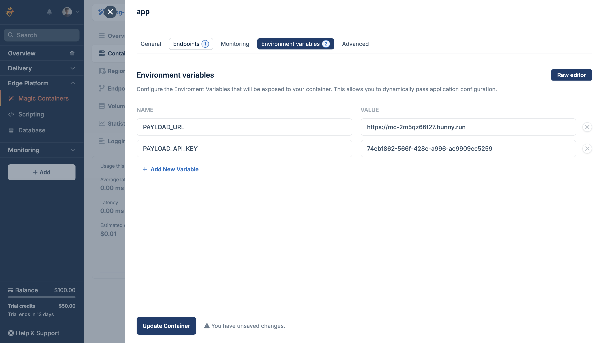
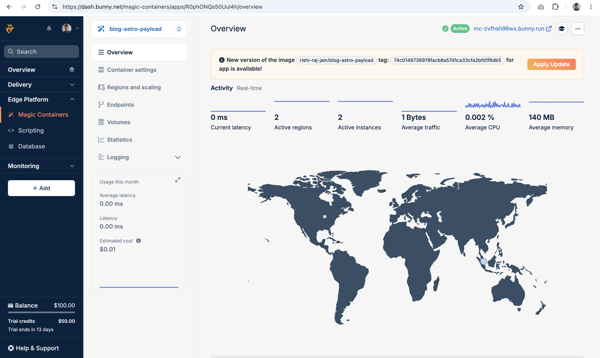

Whenever I want to self-host a blog with a CMS, I often find myself running the backend on the CMS provider’s cloud and hosting the frontend elsewhere, making it a fragmented, multi-service setup. Bunny solves this by providing every layer you need for a self-hosted blog. [Bunny Database](https://bunny.net/database/) offers globally replicated SQLite over libSQL, [Bunny Storage](https://bunny.net/storage/) manages your media files, [Bunny CDN](https://bunny.net/cdn/) serves them quickly from the edge, and [Magic Containers](https://bunny.net/magic-containers/) lets you deploy your containerized apps worldwide.

In this guide, I will show you how to set up a Payload CMS app, create collections for posts, authors, and tags, build an Astro frontend that gets data from Payload, and deploy everything to Magic Containers.

## Prerequisites

To follow along in this guide, you will need the following:

- [Node.js 20](https://nodejs.org/en) or later
- A [Bunny.net](https://bunny.net) account
- A [GitHub](https://github.com) account

## Provision a Globally Replicated SQLite Database

[Bunny Database](https://bunny.net/database/) is a globally replicated SQLite service built on libSQL, so your data stays close to every container replica regardless of which region it runs in.

To get started, open the [Bunny dashboard](https://dash.bunny.net) and go to **Edge Platform > Database**. Click **Create Your First Database**, enter the **Database name**, select **Automatic region selection**, and click **Add database**.


Once it's provisioned, you will see that the Database URL and a Full-Access Token is available for you to use.


Keep the Database URL and Full-Access Token somewhere safe. You will use them as `DATABASE_URL` and `DATABASE_AUTH_TOKEN` when configuring Payload.

## Provision a Bunny Storage Zone

Media uploaded through the Payload admin panel will be stored in Bunny Storage and served from a CDN-backed pull zone. Set this up before configuring Payload so the credentials are ready.

Open the Bunny dashboard and go to **Delivery > Storage**. Click **Add Storage Zone**, give it a name like `blog-payload-media`, and select the primary region closest to your deployment.


Keep the storage zone name somewhere safe. You will use it as `BUNNY_ZONE_NAME` when configuring Payload.

Navigate to the **Access > API / HTTP** tab and copy the **Access Key > Password**.


Keep the password somewhere safe. You will use it as `BUNNY_STORAGE_API_KEY` when configuring Payload.


Next, create a CDN pull zone to serve stored files publicly. Go to **Delivery > CDN** and click **Add Pull Zone**. Enter the zone hostname like `blog-payload-media`, set Origin Type to Storage Zone, select the previously created storage zone from the dropdown and click **Add Pull Zone**.


Once it's provisioned, go to **General > Hostnames** and look for your hostname in **Linked Hostnames**:


Keep the linked hostname somewhere safe. You will use it as `BUNNY_HOSTNAME` when configuring Payload.

## Create a Payload CMS project

Payload's project generator creates a Next.js application with the admin panel embedded. Run the following command to get started:

```bash
pnpm create payload-app@latest backend-payload-sqlite
```

When prompted, choose:

- the blank project template
- `SQLite` as the database
- Enter the `DATABASE_URL` as the connection string
- `none` as the Payload skill

Once the install finishes, change into the project directory:

```bash
cd backend-payload-sqlite
```

Further, install the Bunny Storage plugin:

```bash
pnpm add @seshuk/payload-storage-bunny
```

[@seshuk/payload-storage-bunny](https://github.com/maximseshuk/payload-storage-bunny) is a community adapter that routes Payload media uploads directly to Bunny Storage, built on top of `@payloadcms/plugin-cloud-storage`.

## Configure Payload with Bunny Database

Update the `.env` file in the project root with all the variables you obtained earlier:

```bash
# .env

DATABASE_URL="libsql://your-database-id.lite.bunnydb.net"
DATABASE_AUTH_TOKEN="eyJ0eXAi..."

PAYLOAD_SECRET="generate-a-long-random-string"  # openssl rand -base64 32

BUNNY_STORAGE_API_KEY="..."
BUNNY_ZONE_NAME="blog-payload-media"
BUNNY_HOSTNAME="blog-payload-media.b-cdn.net"
```

Next, open `src/payload.config.ts` and replace its contents with the following to configure the storage and database connection to Bunny:

```typescript
// File: src/payload.config.ts

import { sqliteAdapter } from '@payloadcms/db-sqlite'
import { lexicalEditor } from '@payloadcms/richtext-lexical'
import path from 'path'
import { buildConfig } from 'payload'
import { fileURLToPath } from 'url'
import sharp from 'sharp'
import { bunnyStorage } from '@seshuk/payload-storage-bunny'

import { Users } from './collections/Users'
import { Media } from './collections/Media'
import { Authors } from './collections/Authors'
import { Tags } from './collections/Tags'
import { Posts } from './collections/Posts'

const filename = fileURLToPath(import.meta.url)
const dirname = path.dirname(filename)

export default buildConfig({
  admin: {
    user: Users.slug,
    importMap: {
      baseDir: path.resolve(dirname),
    },
  },
  collections: [Users, Media, Authors, Tags, Posts],
  editor: lexicalEditor(),
  secret: process.env.PAYLOAD_SECRET || '',
  typescript: {
    outputFile: path.resolve(dirname, 'payload-types.ts'),
  },
  db: sqliteAdapter({
    client: {
      // Embedded replica: reads from local file (no replication lag),
      // writes sync back to Bunny Database via syncUrl.
      url: 'file:./payload.db',
      syncUrl: process.env.DATABASE_URL || '',
      authToken: process.env.DATABASE_AUTH_TOKEN || '',
      syncInterval: 60,
    },
  }),
  sharp,
  plugins: [
    bunnyStorage({
      collections: {
        media: {
          prefix: 'media',
          disablePayloadAccessControl: true,
        },
      },
      storage: {
        apiKey: process.env.BUNNY_STORAGE_API_KEY || '',
        hostname: process.env.BUNNY_HOSTNAME || '',
        zoneName: process.env.BUNNY_ZONE_NAME || '',
      },
    }),
  ],
})
```

In the code above:

  - The config sets up Payload to use the Lexical editor for rich content editing in the admin panel.
  - The bunnyStorage plugin is configured to store media uploads on Bunny CDN, with the relevant API key, hostname, and storage zone injected from environment variables.
  - The SQLite adapter is configured to use an **embedded replica** with `url: 'file:./payload.db'`. This stores a local SQLite file that Payload reads from, while `syncUrl` connects to Bunny Database for remote synchronization. Each write is sent immediately to the remote database and the local file is kept in sync, preventing issues with replication lag (such as reading stale data right after a write).

## Set up `next.config.ts`

Update `next.config.ts` to enable standalone output (required for Docker):

```typescript
// File: next.config.ts

import { withPayload } from '@payloadcms/next/withPayload'
import type { NextConfig } from 'next'
import path from 'path'
import { fileURLToPath } from 'url'

const __filename = fileURLToPath(import.meta.url)
const dirname = path.dirname(__filename)

const nextConfig: NextConfig = {
  images: {
    localPatterns: [
      {
        pathname: '/api/media/file/**',
      },
    ],
  },
  webpack: (webpackConfig) => {
    webpackConfig.resolve.extensionAlias = {
      '.cjs': ['.cts', '.cjs'],
      '.js': ['.ts', '.tsx', '.js', '.jsx'],
      '.mjs': ['.mts', '.mjs'],
    }
    return webpackConfig
  },
  turbopack: {
    root: path.resolve(dirname),
  },
  output: 'standalone',
}

export default withPayload(nextConfig, { devBundleServerPackages: false })
```

## Define the collections in TypeScript

Create a `src/collections/` folder if it does not already exist, then add (or update) the following five files.

### Users

```typescript
// File: src/collections/Users.ts

import type { CollectionConfig } from 'payload'

export const Users: CollectionConfig = {
  slug: 'users',
  admin: {
    useAsTitle: 'email',
  },
  auth: {
    useAPIKey: true,
  },
  fields: [],
}
```

`useAPIKey: true` lets Payload generate a long-lived API key for any user. The Astro frontend will use this key in an `Authorization` header to fetch content, so no session cookie or OAuth flow would be needed in production.

### Media

```typescript
// File: src/collections/Media.ts

import type { CollectionConfig } from 'payload'

export const Media: CollectionConfig = {
  slug: 'media',
  access: {
    read: ({ req: { user } }) => Boolean(user),
  },
  fields: [
    {
      name: 'alt',
      type: 'text',
      required: true,
    },
  ],
  upload: true,
}
```

`upload: true` enables file uploads on this collection. The `bunnyStorage` plugin intercepts every upload and routes it to Bunny Storage, so no files are written to the container disk.

### Authors

```typescript
// File: src/collections/Authors.ts

import type { CollectionConfig } from 'payload'

export const Authors: CollectionConfig = {
  slug: 'authors',
  admin: { useAsTitle: 'name' },
  access: { read: ({ req: { user } }) => Boolean(user) },
  fields: [
    { name: 'name', type: 'text', required: true },
    { name: 'bio', type: 'textarea' },
    { name: 'avatar', type: 'upload', relationTo: 'media' },
  ],
}
```

The code defines an Authors collection with author name, bio, and avatar (linked to Media), all readable by authenticated users via API.

### Tags

```typescript
// File: src/collections/Tags.ts

import type { CollectionConfig } from 'payload'

export const Tags: CollectionConfig = {
  slug: 'tags',
  admin: { useAsTitle: 'name' },
  access: { read: ({ req: { user } }) => Boolean(user) },
  fields: [
    { name: 'name', type: 'text', required: true },
    {
      name: 'slug',
      type: 'text',
      required: true,
      admin: { description: 'URL-friendly identifier, e.g. web-performance' },
    },
  ],
}
```

The code defines a Tag collection with name and slug fields, both required, and makes them readable by authenticated users via API.

### Posts

```typescript
// File: src/collections/Posts.ts

import { lexicalEditor } from '@payloadcms/richtext-lexical'
import type { CollectionConfig } from 'payload'

export const Posts: CollectionConfig = {
  slug: 'posts',
  admin: {
    useAsTitle: 'title',
    defaultColumns: ['title', 'author', 'status', 'publishedAt'],
  },
  access: { read: ({ req: { user } }) => Boolean(user) },
  versions: {
    drafts: true,
  },
  fields: [
    { name: 'title', type: 'text', required: true },
    {
      name: 'slug',
      type: 'text',
      required: true,
      unique: true,
      admin: { description: 'URL-friendly identifier, auto-fill from the title' },
    },
    {
      name: 'cover',
      type: 'upload',
      relationTo: 'media',
    },
    {
      name: 'author',
      type: 'relationship',
      relationTo: 'authors',
    },
    {
      name: 'tags',
      type: 'relationship',
      relationTo: 'tags',
      hasMany: true,
    },
    {
      name: 'content',
      type: 'richText',
      editor: lexicalEditor(),
    },
    {
      name: 'publishedAt',
      type: 'date',
      admin: { position: 'sidebar' },
    },
  ],
}
```

The `Posts` collection includes the following fields:

- `title`: a required text field for the post's name.
- `slug`: a required, unique text field used as a URL-friendly identifier. It can be auto-filled from the title.
- `cover`: an optional upload field that relates to a media item, used for the post's cover image.
- `author`: a relationship field linking to an author entry.
- `tags`: a relationship field (can have many entries) linking the post to one or more tag entries.
- `content`: a richText field using the Lexical editor, where the main post content is written.
- `publishedAt`: a date field, shown in the admin sidebar, representing when the post was or will be published.
- `versions: { drafts: true }` on Posts enables the draft/publish workflow.

Every collection uses `read: ({ req: { user } }) => Boolean(user)`. This means any read request, whether from the admin panel or the REST API, must include a valid credential. 

## Start Payload and create an API key

Start the development server:

```bash
pnpm dev
```

It will automatically create a local `payload.db` file and apply your schema in development mode. In the background, Payload also synchronizes your tables to Bunny Database, ensuring your data is ready for use.

Now, visit `http://localhost:3000/admin` in your browser. The first time you access the admin panel, you’ll be prompted to create your admin account. After logging in, start by adding some content:

1. **Authors**: Navigate to the **Authors** collection and create an author entry. This entry is required before you can assign authors to posts.
2. **Media**: Add media files in the **Media** collection. These files can be used as cover images or included in your posts.
3. **Posts**: In the **Posts** collection, click **Create New**. Complete all the required fields i.e. the post's title and slug, select or upload a cover image (which is stored in Bunny Storage and returned as a CDN URL via the API), assign an author, and add the post content using the rich-text editor. Don’t forget to set a **Published At** date in the sidebar. When you’re ready, click **Publish changes** to make the post available.

By following this sequence, you’ll ensure that all necessary references (authors and media) are in place and that your content is correctly organized and accessible both in the Payload admin and through the API.





### Generate an API key for Astro

In the Payload admin panel (`/admin/collections/users/1`), go to **Users**, open your admin user, click **Enable API Key** and click **Save**. Copy the key and save it as `PAYLOAD_API_KEY`. The Astro frontend will send it as an HTTP header on every request.


## Create a new Astro application

Open a new terminal at the parent folder (outside `backend-payload-sqlite`) and scaffold the frontend using:

```bash
npm create astro@latest blog-astro-payload
```

When prompted, choose:

- `use minimal (empty) template` as the starting template.
- `Yes` to install dependencies and initialize a git repository.

Change into the directory and install dependencies:

```bash
cd blog-astro-payload
npm install @payloadcms/richtext-lexical @tailwindcss/typography
```

The packages above provide:

- [@payloadcms/richtext-lexical](https://www.npmjs.com/package/@payloadcms/richtext-lexical): exposes `convertLexicalToHTML`, which converts Payload's Lexical JSON content to HTML at build time.
- [@tailwindcss/typography](https://tailwindcss.com/docs/typography-plugin): the `prose` class for rendering article HTML.

Next, add the Node.js adapter so your Astro app can be built for standalone Node.js deployment. Run the following command and accept all prompts:

```
npx astro add node
```

Next, add the Tailwind CSS integration to your Astro app. Run the following command and accept all prompts:

```
npx astro add tailwind
```

This installs `@tailwindcss/vite` (the official Tailwind CSS plugin for Vite) and sets up a `styles/global.css` automatically.

Next, update `tailwind.config.mjs` to enable the typography plugin to render the article with pre-build classes:

```javascript
// File: tailwind.config.mjs

/** @type {import('tailwindcss').Config} */
export default {
  content: ['./src/**/*.{astro,html,js,jsx,md,mdx,svelte,ts,tsx,vue}'],
  theme: { extend: {} },
  plugins: [require('@tailwindcss/typography')],
}
```
 
Next, create a reusable layout component at `src/layouts/Layout.astro` with the following code:

```astro
---
// File: src/layouts/Layout.astro

import '../styles/global.css'

interface Props {
  title?: string;
}

const { title = "Blog" } = Astro.props;
---

<html lang="en">
  <head>
    <meta charset="utf-8" />
    <link rel="icon" type="image/svg+xml" href="/favicon.svg" />
    <meta name="viewport" content="width=device-width, initial-scale=1" />
    <meta name="generator" content={Astro.generator} />
    <title>{title}</title>
  </head>
  <body class="bg-white text-gray-900 antialiased min-h-screen flex flex-col">
    <header class="border-b border-gray-100 sticky top-0 z-10 bg-white/90 backdrop-blur-sm">
      <div class="max-w-3xl mx-auto px-6 h-14 flex items-center justify-between">
        <a href="/" class="text-sm font-semibold tracking-tight text-gray-900 hover:text-gray-600 transition-colors">
          The Blog
        </a>
        <nav class="flex items-center gap-6 text-sm text-gray-500">
          <a href="/" class="hover:text-gray-900 transition-colors">Posts</a>
        </nav>
      </div>
    </header>

    <main class="flex-1 max-w-3xl mx-auto w-full px-6 py-12">
      <slot />
    </main>

    <footer class="border-t border-gray-100 mt-auto">
      <div class="max-w-3xl mx-auto px-6 py-8 text-sm text-gray-400 text-center">
        All rights reserved.
      </div>
    </footer>
  </body>
</html>
```

Finally, create a `.env` file at the root of the project with the API Key value as obtained from the earlier step:

```bash
# .env

PAYLOAD_URL="http://localhost:3000"
PAYLOAD_API_KEY="your-api-key-from-above"
```

## Create a Payload API client

Create `src/lib/payload.ts` to centralize all API calls. Because every collection requires authentication, every fetch must include an `Authorization` header using the API key format Payload expects:

```typescript
// File: src/lib/payload.ts

const PAYLOAD_URL = import.meta.env.PAYLOAD_URL || 'http://localhost:3000'
const PAYLOAD_API_KEY = import.meta.env.PAYLOAD_API_KEY || ''

const headers = {
  Authorization: `users API-Key ${PAYLOAD_API_KEY}`,
}

export async function getPosts() {
  const res = await fetch(
    `${PAYLOAD_URL}/api/posts?where[_status][equals]=published&sort=-publishedAt&depth=2`,
    { headers }
  )
  if (!res.ok) return []
  const data = await res.json()
  return data.docs || []
}

export async function getPost(slug: string) {
  const res = await fetch(
    `${PAYLOAD_URL}/api/posts?where[slug][equals]=${encodeURIComponent(slug)}&where[_status][equals]=published&depth=2&limit=1`,
    { headers }
  )
  if (!res.ok) return null
  const data = await res.json()
  return data.docs?.[0] || null
}
```

In the code above:

- Bracket notation is required for `where` queries in the Payload REST API. For example, use `where[slug][equals]=value`. If you use JSON-encoded query strings instead, you will get empty results.
- The `depth=2` parameter instructs Payload to expand related fields (like author, tags, and cover) directly in the response, so additional fetches are not necessary on the Astro pages.

## Build the blog index page

Replace the contents of `src/pages/index.astro` with the following code:

```astro
---
// File: src/pages/index.astro

export const prerender = false;

import { getPosts } from "../lib/payload";
import Layout from "../layouts/Layout.astro";

const posts = await getPosts();
---

<Layout title="Blog">
  <div class="mb-12">
    <h1 class="text-3xl font-bold tracking-tight text-gray-900">All Posts</h1>
    <p class="mt-2 text-gray-500 text-sm">{posts.length} {posts.length === 1 ? "article" : "articles"}</p>
  </div>

  {posts.length === 0 && (
    <p class="text-gray-400 text-sm">No posts yet. Check back soon.</p>
  )}

  <ul class="divide-y divide-gray-100">
    {
      posts.map((post: any) => (
        <li class="py-8 first:pt-0 last:pb-0 group">
          <a href={`/${post.slug}`} class="block">
            {post.cover?.url && (
              <div class="overflow-hidden rounded-xl mb-5">
                
              </div>
            )}
            <div class="flex items-start justify-between gap-4">
              <div class="flex-1 min-w-0">
                {post.tags?.length > 0 && (
                  <div class="flex gap-2 flex-wrap mb-2">
                    {post.tags.map((tag: any) => (
                      <span class="text-xs font-medium text-indigo-600 uppercase tracking-wide">
                        {tag.name}
                      </span>
                    ))}
                  </div>
                )}
                <h2 class="text-xl font-semibold text-gray-900 group-hover:text-indigo-600 transition-colors leading-snug">
                  {post.title}
                </h2>
                {post.author?.name && (
                  <div class="mt-3 flex items-center gap-2">
                    {post.author.avatar?.url ? (
                      
                    ) : (
                      <span class="w-6 h-6 rounded-full bg-indigo-100 text-indigo-600 text-xs font-semibold flex items-center justify-center flex-shrink-0">
                        {post.author.name.charAt(0).toUpperCase()}
                      </span>
                    )}
                    <span class="text-sm text-gray-400">{post.author.name}</span>
                  </div>
                )}
              </div>
              <span class="flex-shrink-0 mt-1 text-gray-300 group-hover:text-indigo-400 transition-colors">
                <svg xmlns="http://www.w3.org/2000/svg" class="w-5 h-5" fill="none" viewBox="0 0 24 24" stroke="currentColor" stroke-width="1.5">
                  <path stroke-linecap="round" stroke-linejoin="round" d="M17.25 8.25 21 12m0 0-3.75 3.75M21 12H3" />
                </svg>
              </span>
            </div>
          </a>
        </li>
      ))
    }
  </ul>
</Layout>
```

## Create dynamic post pages

Create `src/pages/[slug].astro` to render individual post pages on the server:

```astro
---
// File: src/pages/[slug].astro

export const prerender = false;

import { getPost } from "../lib/payload";
import Layout from "../layouts/Layout.astro";
import { convertLexicalToHTML } from "@payloadcms/richtext-lexical/html";

const { slug } = Astro.params;
if (!slug) return Astro.redirect("/404");
const post = await getPost(slug);
if (!post) return Astro.redirect("/404");
const html = convertLexicalToHTML({ data: post.content });
---

<Layout title={post.title}>
  <div class="mb-8">
    <a
      href="/"
      class="inline-flex items-center gap-1.5 text-sm text-gray-400 hover:text-gray-900 transition-colors"
    >
      <svg xmlns="http://www.w3.org/2000/svg" class="w-4 h-4" fill="none" viewBox="0 0 24 24" stroke="currentColor" stroke-width="1.5">
        <path stroke-linecap="round" stroke-linejoin="round" d="M10.5 19.5 3 12m0 0 7.5-7.5M3 12h18" />
      </svg>
      All posts
    </a>
  </div>

  {
    post.tags?.length > 0 && (
      <div class="flex gap-2 flex-wrap mb-4">
        {post.tags.map((tag: any) => (
          <span class="text-xs font-medium text-indigo-600 uppercase tracking-wide">
            {tag.name}
          </span>
        ))}
      </div>
    )
  }

  <h1 class="text-4xl font-bold tracking-tight text-gray-900 leading-tight mb-4">
    {post.title}
  </h1>

  {
    post.author?.name && (
      <div class="flex items-center gap-3 mb-8">
        {post.author.avatar?.url ? (
          
        ) : (
          <span class="w-9 h-9 rounded-full bg-indigo-100 text-indigo-600 text-sm font-semibold flex items-center justify-center flex-shrink-0">
            {post.author.name.charAt(0).toUpperCase()}
          </span>
        )}
        <span class="text-sm text-gray-500">{post.author.name}</span>
      </div>
    )
  }

  {
    post.cover?.url && (
      <div class="overflow-hidden rounded-2xl mb-10">
        
      </div>
    )
  }

  <article
    class="prose prose-gray prose-lg max-w-none
      prose-headings:font-semibold prose-headings:tracking-tight
      prose-a:text-indigo-600 prose-a:no-underline hover:prose-a:underline
      prose-code:text-indigo-600 prose-code:bg-indigo-50 prose-code:px-1 prose-code:py-0.5 prose-code:rounded prose-code:text-sm prose-code:font-normal
      prose-pre:bg-gray-950 prose-pre:text-gray-100
      prose-blockquote:border-indigo-300 prose-blockquote:text-gray-500"
    set:html={html || ""}
  />
</Layout>
```

In the pages above:

- Both pages are rendered on the server (`export const prerender = false`), so Astro fetches fresh data from Payload on every request.
- Payload stores the `content` field as Lexical JSON; `convertLexicalToHTML` from `@payloadcms/richtext-lexical/html` is used on the server to generate HTML before sending the response.
- Cover image URLs are provided by Bunny CDN (because `disablePayloadAccessControl: true` is set in the storage plugin), so images are served directly from the edge, bypassing the Payload container.

Start the Astro dev server with `npm run dev` and open `http://localhost:4321` to confirm the index and post pages load. The index page lists every published post with its cover image, title, and author. Clicking a post opens the full article with the Lexical content rendered as HTML.





## Containerize Payload CMS

Create a `Dockerfile` at the project root with the following code. The build uses corepack to enable pnpm, compiles the Next.js standalone output, and copies only the necessary artifacts into the final image:

```dockerfile
# File: backend-payload-sqlite/Dockerfile

FROM node:22-alpine AS base

# Install pnpm 10 explicitly and enable corepack
FROM base AS deps
WORKDIR /app
RUN corepack enable && corepack prepare pnpm@10.0.0 --activate
COPY package.json pnpm-lock.yaml ./
RUN pnpm install --frozen-lockfile

FROM base AS builder
WORKDIR /app
COPY --from=deps /app/node_modules ./node_modules
COPY . .

RUN corepack enable && corepack prepare pnpm@10.0.0 --activate && pnpm run build

FROM base AS runner
WORKDIR /app
ENV NODE_ENV=production

# Correct copy operations to ensure artifacts are present in the final image, using multi-stage build conventions.
COPY --from=builder /app/.next/standalone ./
COPY --from=builder /app/.next/static ./.next/static

ENV PORT=80
EXPOSE 80

CMD ["node", "server.js"]
```

Notice that no database credentials are passed as `ARG` or baked in with `ENV` during the build. The Payload Next.js build does not require `DATABASE_URL` at compile time because the SQLite adapter opens the local file and connects to Bunny Database only at runtime. All secrets are injected by Magic Containers as environment variables when the container starts.

Create `.dockerignore` at the project root with the following code:

```
node_modules
.next
.env
.env.*
!.env.example
payload.db
```

## Containerize Astro

Because both Astro pages run in server-side rendering mode, `PAYLOAD_URL` and `PAYLOAD_API_KEY` are runtime variables. They do not need to be present during the Docker build. Magic Containers injects them at startup.

Create a `Dockerfile` at the project root with the following code:

```dockerfile
# File: blog-astro-payload/Dockerfile

FROM node:22-alpine AS base
WORKDIR /app
COPY package*.json ./

FROM base AS deps
RUN npm install

FROM deps AS build
COPY . .
RUN npm run build

FROM base AS runtime
COPY package*.json ./
RUN npm install --omit=dev
COPY --from=build /app/dist ./dist

ENV HOST=0.0.0.0
ENV PORT=80
EXPOSE 80

CMD ["node", "./dist/server/entry.mjs"]
```

Create `.dockerignore` at the project root with the following code:

```
node_modules
dist
.env
.env.*
!.env.example
```

## Deploy Payload CMS to Magic Containers

In this section, you'll containerize and deploy your Payload CMS to Magic Containers, making it easy to run and manage in a production environment.

### Push the initial image

Create `.github/workflows/build.yml` inside `backend-payload-sqlite` with the following code:

```yaml
# File: .github/workflows/build.yml

name: Build and Push (Payload)

on:
  workflow_dispatch:
  push:
    branches: [main]

env:
  REGISTRY: ghcr.io
  IMAGE_NAME: ${{ github.repository }}

jobs:
  build-and-push:
    runs-on: ubuntu-latest
    permissions:
      contents: read
      packages: write

    steps:
      - uses: actions/checkout@v4

      - name: Log in to GitHub Container Registry
        uses: docker/login-action@v3
        with:
          registry: ${{ env.REGISTRY }}
          username: ${{ github.actor }}
          password: ${{ secrets.GITHUB_TOKEN }}

      - name: Set up Docker Buildx
        uses: docker/setup-buildx-action@v3

      - name: Build and push
        uses: docker/build-push-action@v6
        with:
          context: .
          push: true
          platforms: linux/amd64
          provenance: false
          sbom: false
          tags: ${{ env.REGISTRY }}/${{ env.IMAGE_NAME }}:${{ github.sha }}
```

No `build-args` are needed here because the Payload build does not require database credentials. Push a commit to `main` to trigger the first build. Wait for the "Build and push" step to complete. The workflow output shows the full image name and tag that you will paste into Magic Containers:


### Create the Magic Containers app for Payload

To deploy your Docker container on Bunny, open the [Bunny dashboard](https://dash.bunny.net), go to **Edge Platform > Magic Containers > Add Your First App**. Enter an app name and click **Next Step**.

Now, click **Add Container** and configure the container as follows:

- Set the container name to `app`
- Select **GitHub Public registry**
- Set the image name to your repository path, for example `rishi-raj-jain/backend-payload-sqlite`
- Set the image tag to the commit SHA from your latest GitHub Actions run


Click **Add endpoint**, and then open the **Environment Variables** tab and add the runtime variables:

```
DATABASE_URL             → your Bunny Database libsql:// URL
DATABASE_AUTH_TOKEN      → your full-access auth token
PAYLOAD_SECRET           → your Payload secret
BUNNY_STORAGE_API_KEY    → your Bunny Storage API key
BUNNY_ZONE_NAME          → blog-payload-media
BUNNY_HOSTNAME           → blog-payload-media.b-cdn.net
```


Now, click **Add Container**, then **Next Step**, then **Confirm and Create**.

While the container is being deployed, copy the following two values:

- **App ID** from the URL in the browser (here, `Oluxxx`)
- **Deployment URL** from the top bar in the Bunny dashboard (here, `https://mc-xxx.bunny.run`)


### Enable automatic deploys

Add these secrets to your GitHub repository under **Settings > Secrets and variables > Actions**:

```
BUNNYNET_API_KEY    → your [Bunny API key](https://dash.bunny.net/account/api-key)
APP_ID          → the App ID from the Magic Containers URL
```

Now that the app exists and the secrets are in place, add the Magic Containers update step to your GitHub workflow and push to Git:

```yaml
      - name: Deploy to Magic Containers
        uses: BunnyWay/actions/container-update-image@main
        with:
          container: app
          app_id: ${{ secrets.APP_ID }}
          image_tag: "${{ github.sha }}"
          api_key: ${{ secrets.BUNNYNET_API_KEY }}
```

Pushing this change will automatically trigger the build of a new container image and updates your Magic Containers application with the latest image tag.

With all that done, every future push to `main` builds a new image, pushes it to GHCR, and rolls it out on Magic Containers.

## Deploy Astro to Magic Containers

### Push the initial image

Create `.github/workflows/build.yml` inside `blog-astro-payload`:

```yaml
# File: blog-astro-payload/.github/workflows/build.yml

name: Build and Push (Astro)

on:
  workflow_dispatch:
  push:
    branches: [main]

env:
  REGISTRY: ghcr.io
  IMAGE_NAME: ${{ github.repository }}

jobs:
  build-and-push:
    runs-on: ubuntu-latest
    permissions:
      contents: read
      packages: write

    steps:
      - uses: actions/checkout@v4

      - uses: docker/setup-buildx-action@v3

      - uses: docker/login-action@v3
        with:
          registry: ${{ env.REGISTRY }}
          username: ${{ github.actor }}
          password: ${{ secrets.GITHUB_TOKEN }}

      - name: Build and push
        uses: docker/build-push-action@v6
        with:
          context: .
          push: true
          platforms: linux/amd64
          provenance: false
          sbom: false
          tags: ${{ env.REGISTRY }}/${{ env.IMAGE_NAME }}:${{ github.sha }}

      - name: Deploy to Magic Containers
        uses: BunnyWay/actions/container-update-image@main
        with:
          container: app
          app_id: ${{ secrets.APP_ID }}
          image_tag: "${{ github.sha }}"
          api_key: ${{ secrets.BUNNYNET_API_KEY }}
```

No `build-args` are needed here because the Astro build does not Payload values. Push a commit to `main` to trigger the first build. Wait for the build and push step to complete. The workflow output shows the full image name and tag that you will paste into Magic Containers:



### Create the Magic Containers app for Astro

To deploy your Docker container on Bunny, open the [Bunny dashboard](https://dash.bunny.net), go to **Edge Platform > Magic Containers > Add Your First App**. Enter an app name and click **Next Step**.

Now, click **Add Container** and configure the container as follows:

- Set the container name to `app`
- Select **GitHub Public registry**
- Set the image name to your repository path, for example `rishi-raj-jain/blog-astro-payload`
- Set the image tag to the commit SHA from your latest GitHub Actions run



Click **Add endpoint**, and then open the **Environment Variables** tab and add the runtime variables:

```
PAYLOAD_URL             → the Deployment URL of your Payload Magic Containers app
PAYLOAD_API_KEY     → the API key you generated in the Payload admin panel
```



Click **Add Container**, then **Next Step**, then **Confirm and Create**.

While the container is being deployed, copy the following value:

- **App ID** from the URL in the browser (here, `R0pxxx`)



### Enable automatic deploys

Add these secrets to your GitHub repository under **Settings > Secrets and variables > Actions**:

```
BUNNYNET_API_KEY    → your [Bunny API key](https://dash.bunny.net/account/api-key)
APP_ID          → the App ID from the Magic Containers URL
```

Now that the app exists and the secrets are in place, add the Magic Containers update step to your GitHub workflow and push to Git:

```yaml
      - name: Deploy to Magic Containers
        uses: BunnyWay/actions/container-update-image@main
        with:
          container: app
          app_id: ${{ secrets.APP_ID }}
          image_tag: "${{ github.sha }}"
          api_key: ${{ secrets.BUNNYNET_API_KEY }}
```

With all that done, every future push to `main` builds a new image, pushes it to GHCR, and rolls it out on Magic Containers.

## Summary

In this guide, you built a fully self-hosted blog where Payload CMS connects to Bunny Database over libSQL using an embedded replica to avoid replication-lag errors, media uploads go to Bunny Storage with CDN URLs returned automatically, and the Astro frontend reads from Payload's authenticated REST API using a user API key. The complete stack (database, storage, compute, and CDN) runs on Bunny infrastructure without any third-party managed services.
