Whenever I want to self-host a blog with a CMS, I often find myself running the backend on the CMS provider’s cloud and hosting the frontend elsewhere, making it a fragmented, multi-service setup. Bunny solves this by providing every layer you need for a self-hosted blog. [Bunny Database](https://bunny.net/database/) offers globally replicated SQLite over libSQL, [Bunny Storage](https://bunny.net/storage/) manages your media files, [Bunny CDN](https://bunny.net/cdn/) serves them quickly from the edge, and [Magic Containers](https://bunny.net/magic-containers/) lets you deploy your containerized apps worldwide.

In this guide, I will show you how to set up a Payload CMS app, create collections for posts, authors, and tags, build an Astro frontend that gets data from Payload, and deploy everything to Magic Containers.

## Prerequisites

To follow along in this guide, you will need the following:

- [Node.js 18](https://nodejs.org/en) or later
- A [Bunny.net](https://bunny.net) account
- A [GitHub](https://github.com) account

## Provision a Globally Replicated SQLite Database

[Bunny Database](https://bunny.net/database/) is a globally replicated SQLite service built on libSQL, so your data stays close to every container replica regardless of which region it runs in.

To get started, open the [Bunny dashboard](https://dash.bunny.net) and go to **Edge Platform > Database**. Click **Create Your First Database**, enter the **Database name**, select **Automatic region selection**, and click **Add database**.

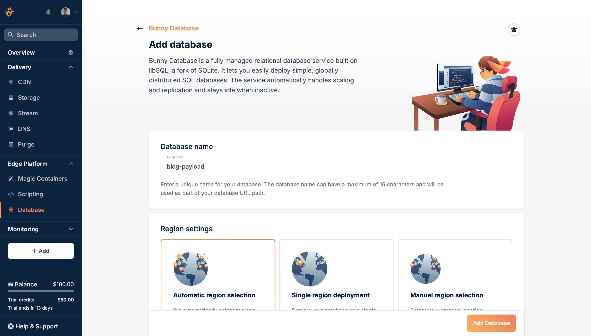

Once it's provisioned, you will see that the Database URL and a Full-Access Token is available for you to use.

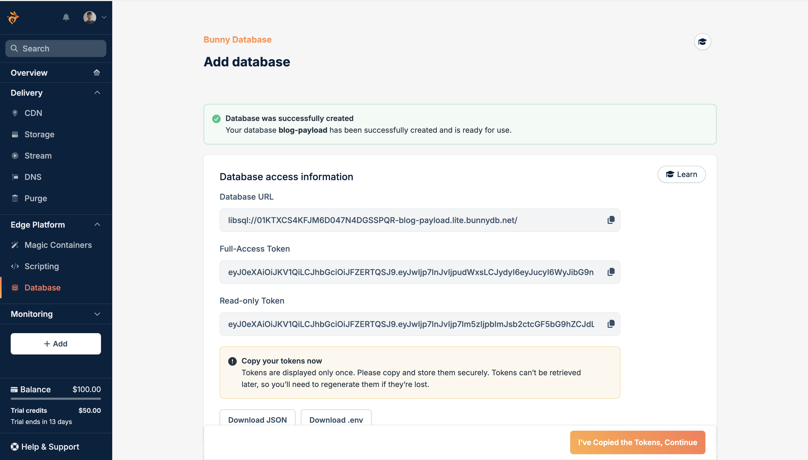

Keep the Database URL and Full-Access Token somewhere safe. You will use them as `DATABASE_URL` and `DATABASE_AUTH_TOKEN` when configuring Payload.

## Provision a Bunny Storage Zone

Media uploaded through the Payload admin panel will be stored in Bunny Storage and served from a CDN-backed pull zone. Set this up before configuring Payload so the credentials are ready.

Open the Bunny dashboard and go to **Delivery > Storage**. Click **Add Storage Zone**, give it a name like `blog-payload-media`, and select the primary region closest to your deployment.

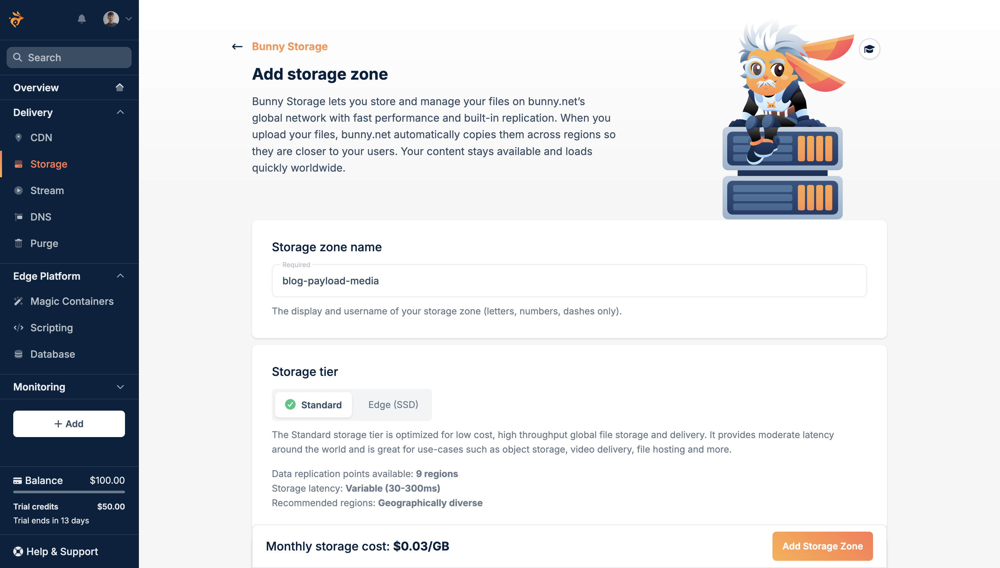

Keep the storage zone name somewhere safe. You will use it as `BUNNY_ZONE_NAME` when configuring Payload.

Navigate to the **Access > API / HTTP** tab and copy the **Access Key > Password**.

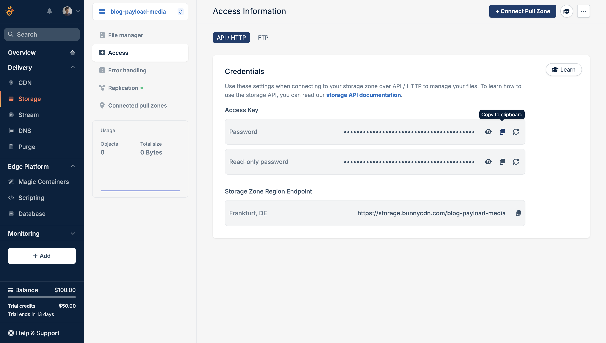

Keep the password somewhere safe. You will use it as `BUNNY_STORAGE_API_KEY` when configuring Payload.


Next, create a CDN pull zone to serve stored files publicly. Go to **Delivery > CDN** and click **Add Pull Zone**. Enter the zone hostname like `blog-payload-media`, set Origin Type to Storage Zone, select the previously created storage zone from the dropdown and click **Add Pull Zone**.

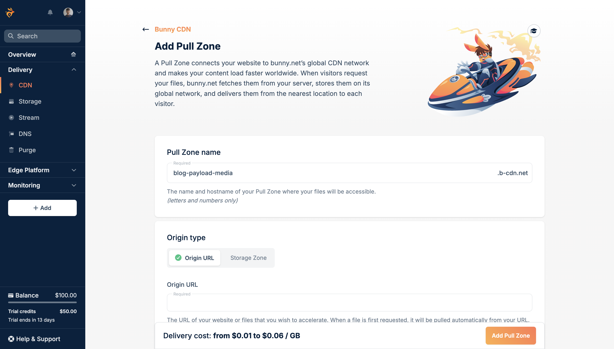

Once it's provisioned, go to **General > Hostnames** and look for your hostname in **Linked Hostnames**:

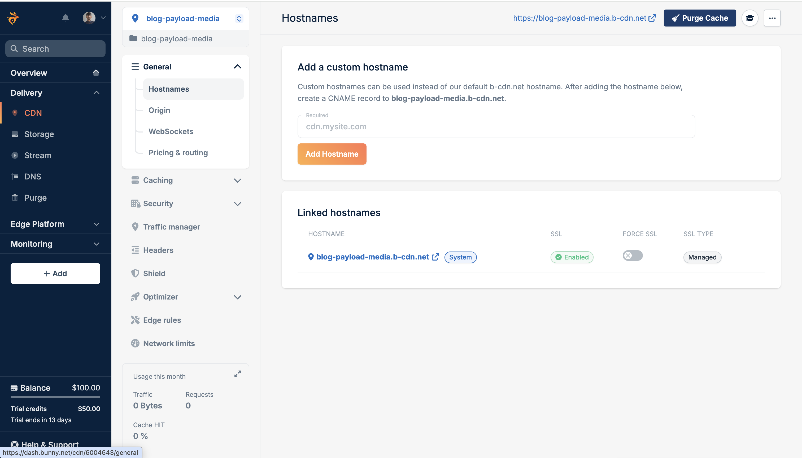

Keep the linked hostname somewhere safe. You will use it as `BUNNY_HOSTNAME` when configuring Payload.

## Create a Payload CMS project

Payload's project generator creates a Next.js application with the admin panel embedded. Run the following command to get started:

```bash
pnpm create payload-app@latest backend-payload-sqlite
```

When prompted, choose:

- the blank project template
- `SQLite` as the database
- Enter the `DATABASE_URL` as the connection string
- `none` as the Payload skill

Once the install finishes, change into the project directory:

```bash
cd backend-payload-sqlite
```

Further, install the Bunny Storage plugin:

```bash
pnpm add @seshuk/payload-storage-bunny
```

[@seshuk/payload-storage-bunny](https://github.com/maximseshuk/payload-storage-bunny) is a community adapter that routes Payload media uploads directly to Bunny Storage, built on top of `@payloadcms/plugin-cloud-storage`.

## Configure Payload with Bunny Database

Update the `.env` file in the project root with all the variables you obtained earlier:

```bash
# .env

DATABASE_URL="libsql://your-database-id.lite.bunnydb.net"
DATABASE_AUTH_TOKEN="eyJ0eXAi..."

PAYLOAD_SECRET="generate-a-long-random-string"  # openssl rand -base64 32

BUNNY_STORAGE_API_KEY="..."
BUNNY_ZONE_NAME="blog-media"
BUNNY_HOSTNAME="blog-media.b-cdn.net"
```

Next, open `src/payload.config.ts` and replace its contents with the following to configure the storage and database connection to Bunny:

```typescript
// File: src/payload.config.ts

import { sqliteAdapter } from '@payloadcms/db-sqlite'
import { lexicalEditor } from '@payloadcms/richtext-lexical'
import path from 'path'
import { buildConfig } from 'payload'
import { fileURLToPath } from 'url'
import sharp from 'sharp'
import { bunnyStorage } from '@seshuk/payload-storage-bunny'

import { Users } from './collections/Users'
import { Media } from './collections/Media'
import { Authors } from './collections/Authors'
import { Tags } from './collections/Tags'
import { Posts } from './collections/Posts'

const filename = fileURLToPath(import.meta.url)
const dirname = path.dirname(filename)

export default buildConfig({
  cors: '*',
  admin: {
    user: Users.slug,
    importMap: {
      baseDir: path.resolve(dirname),
    },
  },
  collections: [Users, Media, Authors, Tags, Posts],
  editor: lexicalEditor(),
  secret: process.env.PAYLOAD_SECRET || '',
  typescript: {
    outputFile: path.resolve(dirname, 'payload-types.ts'),
  },
  db: sqliteAdapter({
    client: {
      // Embedded replica: reads from local file (no replication lag),
      // writes sync back to Bunny Database via syncUrl.
      url: 'file:./payload.db',
      syncUrl: process.env.DATABASE_URL || '',
      authToken: process.env.DATABASE_AUTH_TOKEN || '',
      syncInterval: 60,
    },
  }),
  sharp,
  plugins: [
    bunnyStorage({
      collections: {
        media: {
          prefix: 'media',
          disablePayloadAccessControl: true,
        },
      },
      storage: {
        apiKey: process.env.BUNNY_STORAGE_API_KEY || '',
        hostname: process.env.BUNNY_HOSTNAME || '',
        zoneName: process.env.BUNNY_ZONE_NAME || '',
      },
    }),
  ],
})
```

In the code above:

  - The config sets up Payload to use the Lexical editor for rich content editing in the admin panel.
  - The bunnyStorage plugin is configured to store media uploads on Bunny CDN, with the relevant API key, hostname, and storage zone injected from environment variables.
  - The SQLite adapter is configured to use an **embedded replica** with `url: 'file:./payload.db'`. This stores a local SQLite file that Payload reads from, while `syncUrl` connects to Bunny Database for remote synchronization. Each write is sent immediately to the remote database and the local file is kept in sync, preventing issues with replication lag (such as reading stale data right after a write).
  - Setting `cors: '*'` enables the Astro frontend to access Payload’s REST API from a different origin.

## Set up `next.config.ts`

Update `next.config.ts` to enable standalone output (required for Docker):

```typescript
// File: next.config.ts

import { withPayload } from '@payloadcms/next/withPayload'
import type { NextConfig } from 'next'
import path from 'path'
import { fileURLToPath } from 'url'

const __filename = fileURLToPath(import.meta.url)
const dirname = path.dirname(__filename)

const nextConfig: NextConfig = {
  images: {
    localPatterns: [
      {
        pathname: '/api/media/file/**',
      },
    ],
  },
  webpack: (webpackConfig) => {
    webpackConfig.resolve.extensionAlias = {
      '.cjs': ['.cts', '.cjs'],
      '.js': ['.ts', '.tsx', '.js', '.jsx'],
      '.mjs': ['.mts', '.mjs'],
    }
    return webpackConfig
  },
  turbopack: {
    root: path.resolve(dirname),
  },
  output: 'standalone',
}

export default withPayload(nextConfig, { devBundleServerPackages: false })
```

## Define the collections in TypeScript

Create a `src/collections/` folder if it does not already exist, then add (or update) the following five files.

### Users

```typescript
// File: src/collections/Users.ts

import type { CollectionConfig } from 'payload'

export const Users: CollectionConfig = {
  slug: 'users',
  admin: {
    useAsTitle: 'email',
  },
  auth: {
    useAPIKey: true,
  },
  fields: [],
}
```

`useAPIKey: true` lets Payload generate a long-lived API key for any user. The Astro frontend will use this key in an `Authorization` header to fetch content, so no session cookie or OAuth flow would be needed in production.

### Media

```typescript
// File: src/collections/Media.ts

import type { CollectionConfig } from 'payload'

export const Media: CollectionConfig = {
  slug: 'media',
  access: {
    read: ({ req: { user } }) => Boolean(user),
  },
  fields: [
    {
      name: 'alt',
      type: 'text',
      required: true,
    },
  ],
  upload: true,
}
```

`upload: true` enables file uploads on this collection. The `bunnyStorage` plugin intercepts every upload and routes it to Bunny Storage, so no files are written to the container disk.

### Authors

```typescript
// File: src/collections/Authors.ts

import type { CollectionConfig } from 'payload'

export const Authors: CollectionConfig = {
  slug: 'authors',
  admin: { useAsTitle: 'name' },
  access: { read: ({ req: { user } }) => Boolean(user) },
  fields: [
    { name: 'name', type: 'text', required: true },
    { name: 'bio', type: 'textarea' },
    { name: 'avatar', type: 'upload', relationTo: 'media' },
  ],
}
```

### Tags

```typescript
// File: src/collections/Tags.ts

import type { CollectionConfig } from 'payload'

export const Tags: CollectionConfig = {
  slug: 'tags',
  admin: { useAsTitle: 'name' },
  access: { read: ({ req: { user } }) => Boolean(user) },
  fields: [
    { name: 'name', type: 'text', required: true },
    {
      name: 'slug',
      type: 'text',
      required: true,
      admin: { description: 'URL-friendly identifier, e.g. web-performance' },
    },
  ],
}
```

### Posts

```typescript
// File: src/collections/Posts.ts

import { lexicalEditor } from '@payloadcms/richtext-lexical'
import type { CollectionConfig } from 'payload'

export const Posts: CollectionConfig = {
  slug: 'posts',
  admin: {
    useAsTitle: 'title',
    defaultColumns: ['title', 'author', 'status', 'publishedAt'],
  },
  access: { read: ({ req: { user } }) => Boolean(user) },
  versions: {
    drafts: true,
  },
  fields: [
    { name: 'title', type: 'text', required: true },
    {
      name: 'slug',
      type: 'text',
      required: true,
      unique: true,
      admin: { description: 'URL-friendly identifier, auto-fill from the title' },
    },
    {
      name: 'cover',
      type: 'upload',
      relationTo: 'media',
    },
    {
      name: 'author',
      type: 'relationship',
      relationTo: 'authors',
    },
    {
      name: 'tags',
      type: 'relationship',
      relationTo: 'tags',
      hasMany: true,
    },
    {
      name: 'content',
      type: 'richText',
      editor: lexicalEditor(),
    },
    {
      name: 'publishedAt',
      type: 'date',
      admin: { position: 'sidebar' },
    },
  ],
}
```

Every collection uses `read: ({ req: { user } }) => Boolean(user)`. This means any read request, whether from the admin panel or the REST API, must include a valid credential. `versions: { drafts: true }` on Posts enables the draft/publish workflow.

## Start Payload and create an API key

Start the development server:

```bash
pnpm dev
```

Payload creates the local `payload.db` file, pushes the schema in development mode, and syncs the tables to Bunny Database. Open `http://localhost:3000/admin`, create your first admin account, and then add some Author, Tag, and Post entries. Upload cover images through the Media collection. They land in Bunny Storage and come back as CDN URLs in the API response.

### Generate an API key for Astro

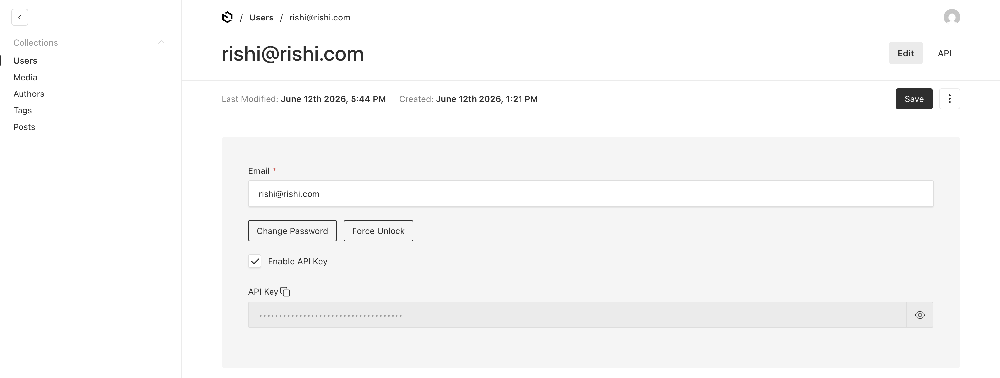

In the Payload admin panel (`/admin/collections/users/1`), go to **Users**, open your admin user, click **Enable API Key** and click **Save**. Copy the key and save it as `PAYLOAD_API_KEY`. The Astro frontend will send it as an HTTP header on every request.

## Create a new Astro application

Open a new terminal at the parent folder (outside `backend-payload-sqlite`) and scaffold the frontend:

```bash
npm create astro@latest blog-astro-payload
```

When prompted, choose:

- `use minimal (empty) template` as the starting template.
- `Yes` to install dependencies and initialize a git repository.

Change into the directory and install dependencies:

```bash
cd blog-astro-payload
npm install @payloadcms/richtext-lexical @tailwindcss/typography
```

The packages above provide:

- [@payloadcms/richtext-lexical](https://www.npmjs.com/package/@payloadcms/richtext-lexical): exposes `convertLexicalToHTML`, which converts Payload's Lexical JSON content to HTML at build time.
- [@tailwindcss/typography](https://tailwindcss.com/docs/typography-plugin): the `prose` class for rendering article HTML.

```
npx astro add node
```

Accept all prompts for the Node.js integration.

```
npx astro add tailwind
```

Accept all prompts for the Tailwind integration. Update `tailwind.config.mjs` to enable the typography plugin:

```javascript
// File: tailwind.config.mjs

/** @type {import('tailwindcss').Config} */
export default {
  content: ['./src/**/*.{astro,html,js,jsx,md,mdx,svelte,ts,tsx,vue}'],
  theme: { extend: {} },
  plugins: [require('@tailwindcss/typography')],
}
```
 
Create `src/layouts/Layout.astro`:

```astro
---
// File: src/layouts/Layout.astro

import '../styles/global.css'
---

<html lang="en">
  <head>
    <meta charset="utf-8" />
    <link rel="icon" type="image/svg+xml" href="/favicon.svg" />
    <meta name="viewport" content="width=device-width" />
    <meta name="generator" content={Astro.generator} />
  </head>
  <body class="bg-white px-6 py-12 max-w-3xl mx-auto">
    <slot />
  </body>
</html>
```

Create a `.env` file in `blog-astro-payload`:

```bash
# .env

PAYLOAD_URL="http://localhost:3000"
PAYLOAD_API_KEY="your-api-key-from-above"
```

## Create a Payload API client

Create `src/lib/payload.ts` to centralize all API calls. Because every collection requires authentication, every fetch must include an `Authorization` header using the API key format Payload expects:

```typescript
// File: src/lib/payload.ts

const PAYLOAD_URL = import.meta.env.PAYLOAD_URL || 'http://localhost:3000'
const PAYLOAD_API_KEY = import.meta.env.PAYLOAD_API_KEY || ''

const headers = {
  Authorization: `users API-Key ${PAYLOAD_API_KEY}`,
}

export async function getPosts() {
  const res = await fetch(
    `${PAYLOAD_URL}/api/posts?where[_status][equals]=published&sort=-publishedAt&depth=2`,
    { headers }
  )
  if (!res.ok) return []
  const data = await res.json()
  return data.docs || []
}

export async function getPost(slug: string) {
  const res = await fetch(
    `${PAYLOAD_URL}/api/posts?where[slug][equals]=${encodeURIComponent(slug)}&where[_status][equals]=published&depth=2&limit=1`,
    { headers }
  )
  if (!res.ok) return null
  const data = await res.json()
  return data.docs?.[0] || null
}
```

Two things to note about the Payload REST API. First, bracket notation is required for `where` queries. The correct form is `where[slug][equals]=value`. JSON-encoded query strings will silently return empty results. Second, `depth=2` tells Payload to expand relationship fields (author, tags, cover) inline so the Astro pages do not need a second fetch.

## Build the blog index page

Replace the contents of `src/pages/index.astro`:

```astro
---
// File: src/pages/index.astro

export const prerender = false;

import { getPosts } from "../lib/payload";
import Layout from "../layouts/Layout.astro";

const posts = await getPosts();
---

<Layout>
  <h1 class="text-4xl font-bold mb-10">Blog</h1>
  <ul class="space-y-10">
    {
      posts.map((post: any) => (
        <li>
          {post.cover?.url && (
            
          )}
          <a
            href={`/${post.slug}`}
            class="text-2xl font-semibold hover:underline"
          >
            {post.title}
          </a>
          {post.author?.name && (
            <p class="mt-1 text-sm text-gray-500">by {post.author.name}</p>
          )}
          {post.tags?.length > 0 && (
            <div class="mt-2 flex gap-2 flex-wrap">
              {post.tags.map((tag: any) => (
                <span class="text-xs bg-gray-100 text-gray-600 px-2 py-1 rounded-full">
                  {tag.name}
                </span>
              ))}
            </div>
          )}
        </li>
      ))
    }
  </ul>
</Layout>
```

## Create dynamic post pages

Create `src/pages/[slug].astro` to render individual post pages on the server:

```astro
---
// File: src/pages/[slug].astro

export const prerender = false;

import { getPost } from "../lib/payload";
import Layout from "../layouts/Layout.astro";
import { convertLexicalToHTML } from "@payloadcms/richtext-lexical/html";

const { slug } = Astro.params;
if (!slug) return Astro.redirect("/404");
const post = await getPost(slug);
const html = convertLexicalToHTML({ data: post.content });
if (!post) return Astro.redirect("/404");
---

<Layout>
  {
    post.cover?.url && (
      
    )
  }
  <h1 class="text-4xl font-bold mb-4">{post.title}</h1>
  {
    post.author?.name && (
      <p class="text-sm text-gray-500 mb-6">by {post.author.name}</p>
    )
  }
  {
    post.tags?.length > 0 && (
      <div class="flex gap-2 flex-wrap mb-8">
        {post.tags.map((tag: any) => (
          <span class="text-xs bg-gray-100 text-gray-600 px-2 py-1 rounded-full">
            {tag.name}
          </span>
        ))}
      </div>
    )
  }
  <article class="prose max-w-none" set:html={html || ""} />
</Layout>
```

Both pages run in server-side rendering mode (`export const prerender = false`), which means Astro fetches data from Payload on every request rather than at build time. Payload stores `content` as Lexical JSON, so `convertLexicalToHTML` from `@payloadcms/richtext-lexical/html` converts it to HTML on the server before the response is sent. Cover image URLs come from Bunny CDN (`disablePayloadAccessControl: true` in the storage plugin), so images are served directly from the edge without the request touching the Payload container.

Start the Astro dev server with `npm run dev` and open `http://localhost:4321` to confirm the index and post pages load.

## Containerize Payload CMS

Create a `Dockerfile` at the project root. The build uses corepack to enable pnpm, compiles the Next.js standalone output, and copies only the necessary artifacts into the final image:

```dockerfile
# File: backend-payload-sqlite/Dockerfile

FROM node:22-alpine AS base

# Install pnpm 10 explicitly and enable corepack
FROM base AS deps
WORKDIR /app
RUN corepack enable && corepack prepare pnpm@10.0.0 --activate
COPY package.json pnpm-lock.yaml ./
RUN pnpm install --frozen-lockfile

FROM base AS builder
WORKDIR /app
COPY --from=deps /app/node_modules ./node_modules
COPY . .

RUN corepack enable && corepack prepare pnpm@10.0.0 --activate && pnpm run build

FROM base AS runner
WORKDIR /app
ENV NODE_ENV=production

# Correct copy operations to ensure artifacts are present in the final image, using multi-stage build conventions.
COPY --from=builder /app/.next/standalone ./
COPY --from=builder /app/.next/static ./.next/static

ENV PORT=80
EXPOSE 80

CMD ["node", "server.js"]
```

Notice that no database credentials are passed as `ARG` or baked in with `ENV` during the build. The Payload Next.js build does not require `DATABASE_URL` at compile time because the SQLite adapter opens the local file and connects to Bunny Database only at runtime. All secrets are injected by Magic Containers as environment variables when the container starts.

Create `.dockerignore` at the project root:

```
node_modules
.next
.env
.env.*
!.env.example
payload.db
```

## Containerize Astro

Because both Astro pages run in server-side rendering mode, `PAYLOAD_URL` and `PAYLOAD_API_KEY` are runtime variables. They do not need to be present during the Docker build. Magic Containers injects them at startup.

Create `blog-astro-payload/Dockerfile`:

```dockerfile
# File: blog-astro-payload/Dockerfile

FROM node:22-alpine AS base
WORKDIR /app
COPY package*.json ./

FROM base AS deps
RUN npm install

FROM deps AS build
COPY . .
RUN npm run build

FROM base AS runtime
COPY package*.json ./
RUN npm install --omit=dev
COPY --from=build /app/dist ./dist

ENV HOST=0.0.0.0
ENV PORT=80
EXPOSE 80

CMD ["node", "./dist/server/entry.mjs"]
```

Create `blog-astro-payload/.dockerignore`:

```
node_modules
dist
.env
.env.*
!.env.example
```

## Deploy Payload CMS to Magic Containers

### Push the initial image

Create `.github/workflows/build.yml` inside `backend-payload-sqlite`:

```yaml
# File: .github/workflows/build.yml

name: Build and Push (Payload)

on:
  workflow_dispatch:
  push:
    branches: [main]

env:
  REGISTRY: ghcr.io
  IMAGE_NAME: ${{ github.repository }}

jobs:
  build-and-push:
    runs-on: ubuntu-latest
    permissions:
      contents: read
      packages: write

    steps:
      - uses: actions/checkout@v4

      - name: Log in to GitHub Container Registry
        uses: docker/login-action@v3
        with:
          registry: ${{ env.REGISTRY }}
          username: ${{ github.actor }}
          password: ${{ secrets.GITHUB_TOKEN }}

      - name: Set up Docker Buildx
        uses: docker/setup-buildx-action@v3

      - name: Build and push
        uses: docker/build-push-action@v6
        with:
          context: .
          push: true
          platforms: linux/amd64
          provenance: false
          sbom: false
          tags: ${{ env.REGISTRY }}/${{ env.IMAGE_NAME }}:${{ github.sha }}
```

No `build-args` are needed here because the Payload build does not require database credentials. Push a commit to `main` to trigger the first build. Once the image lands in GitHub Container Registry, create the Magic Containers app.

Once pushed, wait for the build and push step to complete. The workflow output shows the full image name and tag that you will paste into Magic Containers:

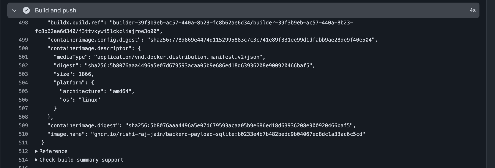

### Create the Magic Containers app for Payload

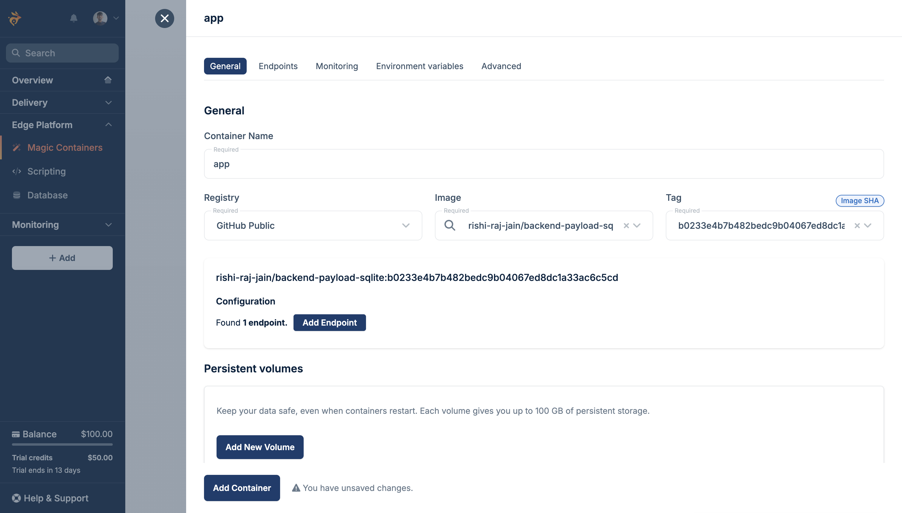

Open the Bunny dashboard and go to **Magic Containers**. Click **Add Application**, paste the image URL from GitHub Container Registry, and click **Create Application**.

Set the container name to **app**, click **Add endpoint**, and then add the environment variables from the steps above:

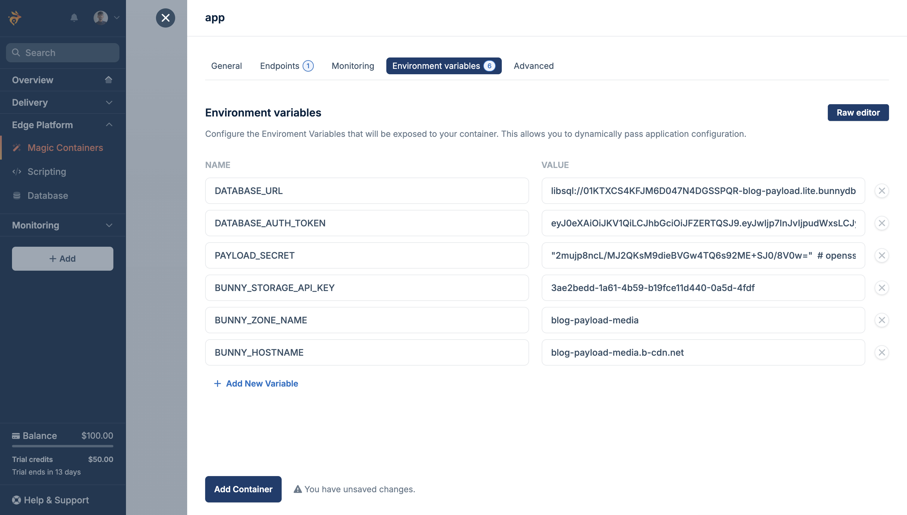

Open the **Environment Variables** tab and add the runtime variables:

```
DATABASE_URL             → your Bunny Database libsql:// URL
DATABASE_AUTH_TOKEN      → your full-access auth token
PAYLOAD_SECRET           → your Payload secret
NEXT_PUBLIC_SERVER_URL   → the Deployment URL of this app
BUNNY_STORAGE_API_KEY    → your Bunny Storage API key
BUNNY_ZONE_NAME          → blog-media
BUNNY_HOSTNAME           → blog-media.b-cdn.net
```

Magic Containers injects these at startup so they never get baked into the image layer. Because the adapter uses an embedded replica (`file:./payload.db`), mount a persistent volume at `/app/payload.db` so the local database file survives container restarts.

After the app is created, copy the **App ID** and the **Deployment URL**. The App ID goes into the `APP_ID` secret in the next step, and the Deployment URL is the value for `NEXT_PUBLIC_SERVER_URL` in your environment variables.

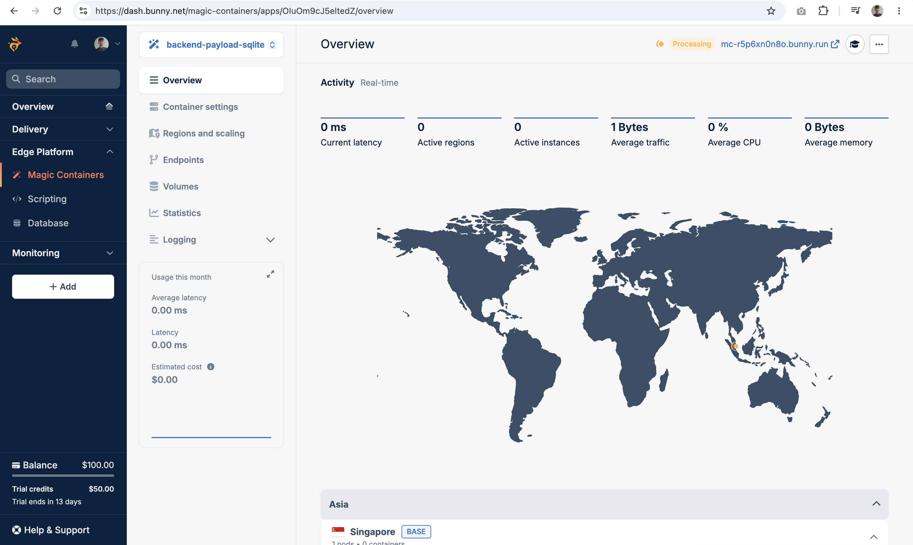

### Enable automatic deploys

Add these secrets to your GitHub repository under **Settings > Secrets and variables > Actions**:

```
BUNNYNET_API_KEY    → your [Bunny API key](https://dash.bunny.net/account/api-key)
APP_ID          → the App ID from the Magic Containers URL
```

Add the deploy step to `build.yml`:

```yaml
      - name: Deploy to Magic Containers
        uses: BunnyWay/actions/container-update-image@main
        with:
          container: app
          app_id: ${{ secrets.APP_ID }}
          image_tag: "${{ github.sha }}"
          api_key: ${{ secrets.BUNNYNET_API_KEY }}
```

With all that done, every future push to `main` builds a new image, pushes it to GHCR, and rolls it out on Magic Containers.

## Deploy Astro to Magic Containers

### Push the initial image

Create `.github/workflows/build.yml` inside `blog-astro-payload`:

```yaml
# File: blog-astro-payload/.github/workflows/build.yml

name: Build and Push (Astro)

on:
  workflow_dispatch:
  push:
    branches: [main]

env:
  REGISTRY: ghcr.io
  IMAGE_NAME: ${{ github.repository }}

jobs:
  build-and-push:
    runs-on: ubuntu-latest
    permissions:
      contents: read
      packages: write

    steps:
      - uses: actions/checkout@v4

      - uses: docker/setup-buildx-action@v3

      - uses: docker/login-action@v3
        with:
          registry: ${{ env.REGISTRY }}
          username: ${{ github.actor }}
          password: ${{ secrets.GITHUB_TOKEN }}

      - name: Build and push
        uses: docker/build-push-action@v6
        with:
          context: .
          push: true
          platforms: linux/amd64
          provenance: false
          sbom: false
          tags: ${{ env.REGISTRY }}/${{ env.IMAGE_NAME }}:${{ github.sha }}

      - name: Deploy to Magic Containers
        uses: BunnyWay/actions/container-update-image@main
        with:
          container: app
          app_id: ${{ secrets.APP_ID }}
          image_tag: "${{ github.sha }}"
          api_key: ${{ secrets.BUNNYNET_API_KEY }}
```

### Create the Magic Containers app for Astro

Open the Bunny dashboard and go to **Magic Containers**. Click **Add Application**, paste the image URL from GitHub Container Registry, and click **Create Application**.

After the app is created, copy the **App ID** and the **Deployment URL**.

Open the **Environment Variables** tab and add the runtime variables:

```
PAYLOAD_URL             → the Deployment URL of your Payload Magic Containers app
PAYLOAD_API_KEY     → the API key you generated in the Payload admin panel
APP_ID     → the App ID of your Astro Magic Containers app
```

Magic Containers injects these at startup so they never get baked into the image layer.

### Enable automatic deploys

Add these secrets to your GitHub repository under **Settings > Secrets and variables > Actions**:

```
BUNNYNET_API_KEY    → your [Bunny API key](https://dash.bunny.net/account/api-key)
APP_ID          → the App ID from the Magic Containers URL
```

Add the deploy step to `build.yml`:

```yaml
      - name: Deploy to Magic Containers
        uses: BunnyWay/actions/container-update-image@main
        with:
          container: app
          app_id: ${{ secrets.APP_ID }}
          image_tag: "${{ github.sha }}"
          api_key: ${{ secrets.BUNNYNET_API_KEY }}
```

With all that done, every future push to `main` builds a new image, pushes it to GHCR, and rolls it out on Magic Containers.

## Summary

In this guide, you built a fully self-hosted blog where Payload CMS connects to Bunny Database over libSQL using an embedded replica to avoid replication-lag errors, media uploads go to Bunny Storage with CDN URLs returned automatically, and the Astro frontend reads from Payload's authenticated REST API using a user API key. The complete stack (database, storage, compute, and CDN) runs on Bunny infrastructure without any third-party managed services.

As a next step, consider adding a webhook from Payload that triggers a new Astro build whenever you publish content, or extend the Posts collection with a `seo` group using Payload's built-in SEO plugin.
